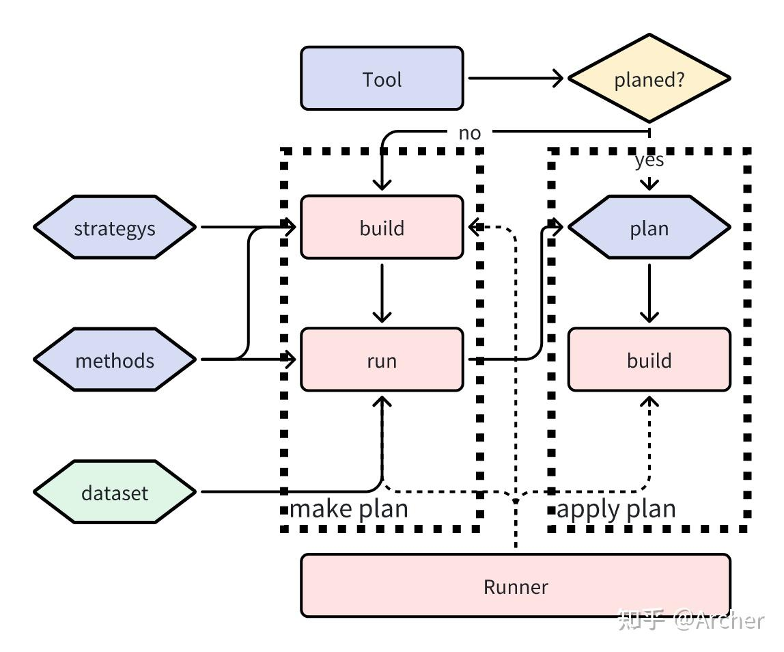

# MSCTools 设计特点

参考： [【我与TVM二三事 后篇（4）】MSC之MSCTools](https://zhuanlan.zhihu.com/p/680796444)

MSCTools 是 MSC 架构独有的核心设计之一，也是 MSC 区别于传统 AI 编译器或压缩工具链的最重要的点。MSCTools 的设计也经历了多次迭代，从一开始的耦合于 torch 的工具链，到依附于 TensorRT 的特定功能模块，再到最终的完全从训练和部署框架解耦变成独立体系，可以说一路走来都是教训不断推动着对模型压缩逻辑进行拆分解耦。

一方面，压缩算法和训练框架耦合太深会存在对硬件信息失去感知的情况。例如随着硬件配套的生态逐步迭代，计算图优化和算子融合的策略也会持续更新，这会影响到量化策略，这样在训练框架中开发量化就不得不持续去反推硬件行为，随着硬件的选择越来越多，这种方式的维护成本会迅速增加。

另一方面，压缩工具和部署框架耦合太深则放弃了训练能力，基本只能选各种 PTQ 的方式，对于压缩效果更好但需要训练的稀疏化、剪枝和蒸馏等技术基本只能放弃。而比较好的压缩技术往往都需要配合训练，所以耦合部署框架的压缩工具上限并不高。

经历了各种坑之后，我在设计MSC时选择将压缩工具抽象出来，这样：1.方便新的压缩工具的开发，以及向新训练/部署框架集成；2.统一管理调配各种压缩工具，从而实现不同压缩算法的配合，如剪枝+量化+蒸馏。但相应的开发MSCTool有一些代价，即压缩算法开发过程使用的基础数据变成了MSCGraph这一层抽象，而不是torch.Module、tvm.IRModule这类具体的框架计算图。

MSCTool和MSCRunner共同作用对模型进行压缩，基本流程如下：

