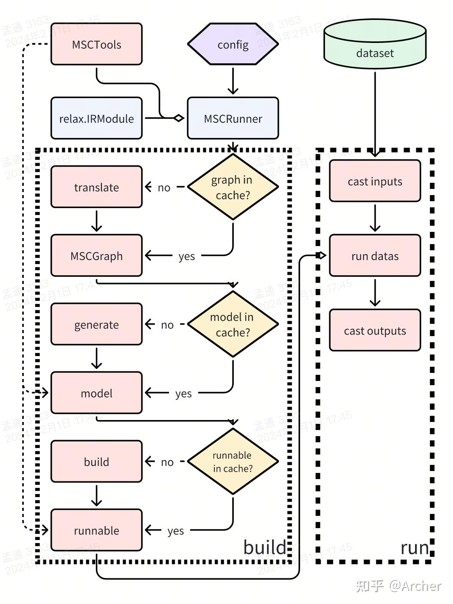

# MSC 运行器

```{toctree}

TorchRunner
TVMRunner
TensorflowRunner
```

MSC 中 {class}`~tvm.contrib.msc.core.runtime.BaseRunner` 抽象类，提供了模型构建和执行的接口，具体实现由不同的 runtime 系统提供。

1. {meth}`~tvm.contrib.msc.core.runtime.BaseRunner.build` 方法用于构建 runnable 对象（例如 `TorchRunner` 对应的 runnable 对象是 {class}`torch.nn.Module`， {class}`~tvm.contrib.msc.framework.tvm.runtime.TVMRunner` 对应的 runnable 可以是 {class}`tvm.relax.VirtualMachine`），此过程产生三个阶段的object，每个阶段都会尝试从 cache 中读取，以此减少构建时间，每个阶段的任务为：
    1. `IRModule -> MSCGraph`：通过 {func}`~tvm.contrib.msc.core.frontend.translate.from_relax` 将传入的 relax IRModule 构建为 MSCGraph，此过程参考[test_graph_build](https://github.com/apache/tvm/blob/main/tests/python/contrib/test_msc/test_graph_build.py)
    2. `MSCGraph -> model`：调用Codegen将MSCGraph转换成不同runtime中的model，注意model并不一定是runnable对象，例如tensorflow中model是tf.Graph，而runnable为Session；tvm中model是relax.IRModule，而runnable为VirtualMachine。将model和runnable分开成两个阶段主要考虑不同框架中计算图描述和运行时对象可能并不相同。此过程Unittest参考：[test_translate_relax.py](https://github.com/apache/tvm/blob/main/tests/python/contrib/test_msc/test_translate_relax.py)、[test_translate_torch.py](https://github.com/apache/tvm/blob/main/tests/python/contrib/test_msc/test_translate_torch.py)、[test_translate_tensorflow.py](https://github.com/apache/tvm/blob/main/tests/python/contrib/test_msc/test_translate_tensorflow.py)。如果创建了MSCTool，Codegen过程根据tools的配置插入埋点对tensor进行操作，在构建model的时候会对计算图进行改造（例如插入q/dq节点，对weights添加mask等）
    3. `model -> runnable`：根据配置将model转换为runnable对象，runnable对象可以控制MSCTools在runtime过程中对压缩行为进行控制。这部分逻辑不包含MSC特有逻辑，主要是调用框架的build方法将计算图变成可执行对象。

2. {meth}`~tvm.contrib.msc.core.runtime.BaseRunner.run` 执行数据：直接调用 {meth}`~tvm.contrib.msc.core.runtime.BaseRunner.build` 阶段得到的 runnable 对象跑数据，但由于不同 runnable 支持的输入数据格式不同，需要在数据输入和数据导出的时候进行两次 cast，将 MSC 标准数据（`np.array`）和框架中的数据格式互相转换。默认情况下 {meth}`~tvm.contrib.msc.core.runtime.BaseRunner.run` 函数输入输出均为 `dict<str:np.array>` 格式。

MSCRunner 被 MSCManager 管理，并暴露隔离具体 runtime 类型的 forward 接口，用于运行数据。
runnable 对象可以调用 `MSCTools` 对 runtime 过程进行控制（例如稀疏化过程的 apply mask，量化过程的 q/dq 运算等），并且可以被 runtime 系统直接加载。
`MSCRunner` 屏蔽了 runtime 类型的差异，可以让 `MSCManger` 专注于流程控制而不需要处理 runtime 的细节。一个 `MSCRunner` 中包含 1 到多个 `MSCGraph` （BYOC 的 Runner 可以有多个 `MSCGraph`）以及 `MSCTools`。核心方法是 `build` （构建 runnable 对象）和 run（跑数据）

