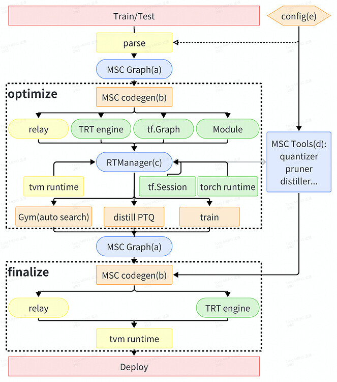

# MSC 简介

参考：[【我与TVM二三事 后篇（1）】MSC简介](https://zhuanlan.zhihu.com/p/680638069)

[MSC](https://discuss.tvm.apache.org/t/rfc-unity-msc-introduction-to-multi-system-compiler/15251)（Multi-System Compiler，多系统编译器）旨在将 `tvm` 与其他机器学习框架（例如 `torch`、`tensorflow`、`tensorrt` 等）和系统（例如训练系统、部署系统等）连接起来。借助 MSC，可以开发模型压缩方法，如高级 PTQ（训练后量化）、QAT（量化感知训练）、修剪训练、稀疏训练、知识蒸馏等。此外，MSC 将模型编译过程管理为流水线，因此可以轻松地基于 MSC 构建模型编译服务（Saas）和编译工具链（tool-chain）。

MSC 被用作 NIO.Inc 的 AI 引擎的重要部分。介绍可以在 TVMConf 2023(TVM @ NIO) 找到。

这个开源版本的 MSC 与 NIO.Inc 中的MSC有以下不同：

- NIO中的运行时优化和量化不会被包含在这个开源版本中。
- 这个版本使用relax和relay来构建MSCGraph，而在 NIO 中只使用 relay。
- 这个版本专注于自动压缩和训练相关的优化方法，而 NIO 的 AI 引擎更注重运行时加速和与自动驾驶相关的量化。

## 动机

随着 TVM 的优化，模型性能和内存管理已经达到了一个相对较高的水平。为了将模型性能提升到更高的层次，同时确保准确性，需要新的方法。模型压缩技术被证明在提高模型性能的同时减少内存消耗方面是有用的。常规的压缩方法，如修剪和量化，需要算法、软件和硬件系统的合作，这使得压缩策略难以开发和维护，因为信息格式因系统而异，压缩策略也因案例而异。为了与不同的系统协作并开发作为模型无关工具的压缩算法，需要用于保存、传递和转换信息的架构。

## 参考级解释

MSC 中的编译流水线如下所示：

### 核心概念：

MSCGraph：MSC 的核心 IR（中间表示）。MSCGraph 是 Relax.Function/Relay.Function 的 DAG（有向无环图）格式。

- MSC codegen：为框架生成模型构建代码（包括控制 MSCTool 的包装器）。
- RuntimeManager：管理运行时、MSCGraphs 和 MSCTools 的抽象模块。
- MSCTools：决定压缩策略并控制压缩过程的工具。此外，还为调试添加了一些额外的工具到MSCTools中。
- Config：MSC 使用配置来控制编译过程。这使得编译过程易于被记录和重放。

### 编译过程：

编译过程包含两个主要阶段：优化(optimize)和最终化(finalize)。optimize and finalize

优化阶段用于通过压缩来优化模型。这个阶段可能会使用训练框架，并且消耗大量的时间和资源（例如自动压缩、知识蒸馏和训练）。

最终化阶段用于在所需环境中构建模型。这个阶段从优化后的 `relax` 模块（检查点）开始，并在目标环境中构建该模块，不进行任何优化。这个阶段可以在所需环境中进行处理，而不会消耗大量时间和资源。
