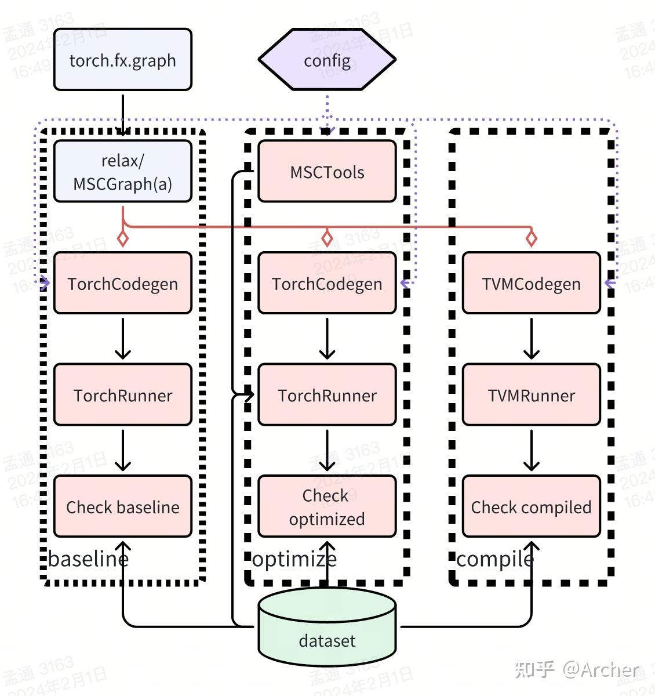

# MSC 编译流程

MSC将编译流程流程分成三个大块：基础检查+优化+编译。这种划分没有一定之规，主要根据个人之前模型优化和编译的经验得来。以优化编译 `torch` 模型为例，整体流程为：

MSC编译流程中每个流程都可以单独执行并打包下一阶段需要的原料，即每个过程都可以Saas化。这种设计方便提升模型发布效率，例如需要在云+端不同环境中发布同样的模型，就可以在云上环境调用基础检查和优化服务，再在每一个需要部署模型的环境中并行调用编译服务，这样既保证了端云一致性，也避免了在端侧机器上跑耗时的模型优化任务。

## 基础检查（baseline）
作为MSC编译过程的第一阶段，基础检查部分将训练框架的模型（`torch.fx.graph`/`onnx`等）解析为 `relax` 并通过 `tvm` 的 pass 进行计算图级别优化，再根据部署配置映射成 MSCGraph，此阶段生成的 MSCGraph 就是 MSC 整个编译流程的计算逻辑的唯一表达，不会再被优化。

MSCGraph 会被对应的 runner 转换成 runnable 对象（例如 `torch` 框架使用 `TorchRunner` 转换为 `torch.nn.Module`），并使用测试数据进行 `forward`，得到的结果会和原始模型的结果比对计算误差。此过程不会使用任何 MSCTools（tracker 除外），只做 baseline 的验证，目的是验证 MSCGraph 计算逻辑的正确性。

## 优化（optimize）
基础检查通过后的模型会进入到优化过程，这也是MSC编译流程中的核心部分。优化过程使用基础检查产生的MSCGraph，根据配置创建MSCTools，如果存在多个Tool，MSC以串行顺序调用Tool：pruner->quantizer->distiller。每一个tool和MSCGraph被runner接收并按照tool的配置生成plan，plan用于最终compile阶段对模型进行改造，由于runner屏蔽了不同框架forward的区别，MSC在基础检查阶段准备的dataset可以无差别用于各种runtime系统。

在所有的tool都被创建了plan之后，MSCManager再次调用Runner构建runnable对象，并apply所有的plan，结果也会和baseline的数据进行比对，用于记录tool对最终结果的影响。

## 编译（compile）
优化阶段得到所有tool的plan之后进入最终编译阶段。此阶段基本等于优化阶段的最后验证步骤，唯一区别的Runner类型和优化阶段的不同。此阶段使用的Runner会产出可用于部署的序列化文件，并对验证数据进行forward，结果和baseline结果比对，用来查看部署过程的结果误差。

## 总结

MSC将编译过程分成基础检查+优化+编译三个阶段，每个阶段都有独立的导入/导出功能可以独立成为一个Saas。

- `MSCRunner` 是整个过程的核心部分，用于构建runnable对象并管理runtime。
- `MSCManager` 是MSC编译过程的完整封装，用于作为工具链或发布系统的内核。
- `MSCWrapper`则是在 `MSCManager` 上再次封装的工具链