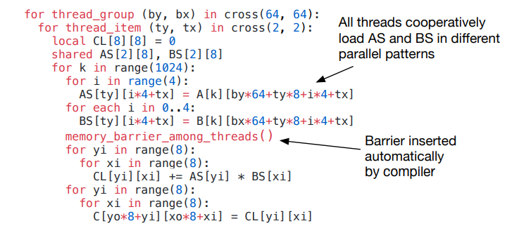

# TVM

论文：[TVM: An Automated End-to-End Optimizing Compiler for Deep Learning](https://arxiv.org/abs/1802.04799)

TVM 目标：缩短前端框架（基于计算图）与后端硬件的差距。

## 简介

当前 DL 框架（如 TensorFlow，MXNet，Caffe 和 Pytorch）依赖于计算图优化。计算图级优化与硬件后端特定的算子级存在极大的鸿沟。特定于硬件的算子往往受制于其供应商，可定制差。即使受支持的后端，同样存在：

- 预定义的算子库有限，用户不能灵活添加新的算子
- 即使支持定义新算子，而硬件优化需要供应商再次调谐

对于不同的硬件后端，要同时启用图级和算子级的优化，TVM 采取了完全不同的端到端方法：**定义一种编译器，它从现有框架中获取深度学习程序的高级规范，并为不同的硬件后端集生成低级优化代码**。

存在两大挑战：

- 自适应特定的硬件特性和抽象
- 自动调谐生成高效的代码

TVM 通过三个关键模块来解决这些挑战：

1. 引入了 **张量表达式语言** （tensor expression language）来构建算子，并提供程序变换原语（program transformation primitives） 用于生成具有各种优化的程序的不同版本。该层延伸 Halide 的计算/调度分离概念也通过将目标硬件 intrinsics 从变换原语中分离出来，从而支持新的加速器及其相应的新 intrinsics。此外，引入了新的变换原语来解决 GPU 相关的挑战，并支持部署到专门的加速器。然后可以应用不同序列的程序变换，为给定的算子声明，形成丰富的有效程序空间。
2. 引入 **自动程序优化框架** 来寻找优化的张量算子。优化器由基于 ML 的成本模型指导，当从硬件后端收集更多数据时，该模型可以进行调整和改进。
3. 在自动代码生成器之上，引入了 **图重写器** （graph rewriter），它充分利用了高层级和算子层级的优化。

通过结合这三个模块，TVM 可以从现有的深度学习框架中获取模型描述，联合高、低层次优化，并为后端（如 CPU、GPU 和基于 FPGA 的专用加速器）生成特定于硬件的优化代码。

该论文的主要贡献：

- 确定了在跨不同硬件后端为深度学习工作负载以提供性能可移植性方面的主要优化挑战。
- 引入了新颖的调度原语，它利用了跨线程内存重用、新颖的硬件 intrinsics 和延迟隐藏。
- 提出并实现了基于机器学习的优化系统，以自动探索和优化的张量算子。
- 构建了一个端到端编译和优化堆栈，允许在高级框架（包括 TensorFlow、MXNet、PyTorch、Keras、CNTK）中指定的深度学习工作负载部署到不同的硬件后端（包括 CPU、服务器 GPU、嵌入式 GPU 和基于 FPGA 的加速器）。

开源 TVM 在几家大公司内部量产使用。在服务器级 GPU，嵌入式 GPU，嵌入式 CPU 和定制的基于 FPGA 的通用加速器上，使用真实的工作负荷，对 TVM 进行了评估。实验结果表明，TVM 具有便携性跨后端的性能实现加速，在现有框架的基础上，由手工优化的库支持，从 1.2× 到 3.8× 不等。

## 概述

```{figure} images/tvm-into.png
:align: left

系统首先从现有框架中获取模型作为输入，并将其变换为计算图表示。然后，它执行高级数据流重写以生成优化的计算图。算子级优化模块必须为计算图中每个融合算子生成高效代码。算子是在声明式张量表达式语言中指定的；执行细节未指定。TVM 为给定硬件目标的算子标识了一组可能的代码优化。可能的优化空间很大，因此使用基于 ML 的成本模型来寻找优化的算子。最后，系统将生成的代码打包到可部署的模块中。
```

### 终端用户的例子

在几行代码中，用户可以从现有的深度学习框架中获取一个模型，并调用 TVM API 来获得可部署的模块：

```python
import tvm as t
# 使用 keras 框架作为例子，导入模型
graph, params = t.frontend.from_keras(keras_model)
target = t.target.cuda()
graph, lib, params = t.compiler.build(graph, target, params)
```

编译后的运行时模块包含三个组件：最终优化的计算图（`graph`）、生成的算子（`lib`）和模块参数（`params`）。这些组件可以用来将模型部署到目标后端：

```python
from tvm import runtime
module = runtime.create(graph, lib, t.cuda(0))
module.set_input(**params)
module.run(data=data_array)
output = tvm.nd.empty(out_shape, ctx=t.cuda(0))
module.get_output(0, output)
```

TVM 支持多种语言的部署后端，如 C++、Java 和 Python。本文的其余部分描述了 TVM 的体系结构，以及系统程序员如何扩展它以支持新的后端。

## 优化计算图

计算图是在 DL 框架中表示程序的常用方法。

```{figure} images/graph.png
:align: left

两层卷积神经网络的计算图示例。图中的每个节点表示消耗一个或多个张量并产生一个或多个张量的算子。张量算子可以通过属性参数化来配置它们的行为（例如，填充或步长）。
```

这种高级表示和低级的编译器中间表示（intermediate representation，简称 IR，如 LLVM）之间的主要区别是：中间数据项是大型多维张量。计算图提供了算子的全局视图，但它们避免指定每个算子必须如何实现。与 LLVM IR 一样，计算图可以转换为功能等价的计算图来应用优化。利用常见 DL 工作负载中的形状特异性，对固定的输入形状集进行优化。

TVM 利用计算图表示来应用高级优化：节点表示张量或程序输入上的算子，而边表示算子之间的数据依赖关系。它实现了多种图级优化，包括：算子融合（operator fusion，将多个小算子融合在一起）、常数折叠（constant-folding，预先计算可以静态确定的 graph 部分，节省执行成本）、静态内存规划传递（static memory planning pass，它预先分配内存来保存每个中间张量）、数据布局转换（data layout
transformations，将内部数据布局转换为后端友好的形式）。

### 算子融合

算子融合将多个算子合并成一个内核，而不将中间结果保存在内存中。特别是在 GPU 和专门的加速器中，这种优化可以大大减少执行时间。具体来说，可以识别出四类计算图算子：

1. 单射（injective，一对一映射，例如，add)，
2. 约简（例如，sum）
3. 复杂输出可融合（可以将元素映射融合到输出，例如，conv2d）
4. 不透明（不能融合，例如，sort）

TVM 提供了通用规则来融合这些算子，如下所示。多个单射算子可以融合成另一个单射算子。约简算子可以与输入的单射算子融合（如融合 scale 和 sum）。像 conv2d 这样的算子是复杂输出可融合的，可以将基于元素的算子融合到其输出中。可以应用这些规则将计算图转换成融合的版本。

### 数据布局变换

在计算图中存储给定张量有多种方法。最常见的数据布局选择是列为主和行为主。在实践中，我们可能更喜欢使用更复杂的数据布局。例如，DL加速器可能利用 4 x 4 个矩阵算子，需要将数据平铺成 4 x 4 块，以优化访问位置。

数据布局优化将计算图转换为可以使用更好的内部数据布局在目标硬件上执行的图。首先，在给定内存层次结构所规定的约束条件下，指定每个算子的首选数据布局。然后，如果生产者和消费者偏好的数据布局不匹配，我们将在二者之间执行适当的布局变换。

虽然高级图优化可以极大地提高 DL 工作负载的效率，但它们的效率与算子库所提供的一样。目前，少数支持算子融合的 DL 框架要求算子库提供融合模式的实现。随着更多的神经网络算子的定期引入，可能的融合核的数量会急剧增长。当针对硬件后端数量不断增加时，这种方法不再是可持续的，因为所需的融合模式实现数量与必须支持的数据布局、数据类型和加速器 intrinsics 的数量相结合。为程序所需的各种算子和每个后端，手工制作算子内核是不可行的。接下来，TVM 提出代码生成（code generation）方法，它可以为给定的模型算子生成各种可能的实现。

## 生成张量算子

TVM 通过在每个硬件后端生成许多有效的实现并选择一个优化的实现，为每个算子生成有效的代码。这个过程建立在 Halide 将描述与计算规则（或调度优化）解耦的思想之上，并将其扩展以支持新的优化（嵌套并行性、张量化和延迟隐藏）和大量的硬件后端。现在重点介绍特定于 TVM 的特性。

### 张量表达式和调度空间

TVM 引入了一个张量表达式语言来支持自动代码生成。与高级计算图表示不同，张量算子的实现是不透明的，每个算子都用索引公式表达式语言描述。

下面的代码显示了一个计算转置矩阵乘法的张量表达式示例：


每个计算算子都指定了输出张量的形状和描述如何计算它的每个元素的表达式。张量表达式语言支持通用的算术和数学操作，并涵盖了通用的 DL 算子模式。该语言没有指定循环结构和许多其他执行细节，并且为各种后端添加硬件感知优化提供了灵活性。采用 Halide 的解耦计算/调度原理，使用调度来表示从张量表达式到低级代码的特定映射。许多可能的调度都可以执行这个功能。

通过增量地应用基本转换（调度原语）来构建调度，这些变换保持了程序的逻辑等价性。在内部，当应用调度变换时，TVM 使用一个数据结构来跟踪循环结构和其他信息。这些信息可以帮助为给定的最终调度生成低级代码。

```{figure} images/tensor-shedule.png
:align: left

TVM 进度降低和代码生成过程。该表列出了现有的 Halide 和新的 TVM 调度原语，用于优化 CPU、GPU 和加速器后端调度。张量化对于加速器来说是必不可少的，但它也可以用于 CPU 和 GPU。特殊的内存作用域可以在 GPU 中重用内存，并在加速器中显式管理片内内存。延迟隐藏（latency hiding）是特定于类似 TPU 的加速器。
```

重用了有帮助的原语和 Halide 的低级循环程序 AST，并引入了新的原语来优化 GPU 和加速器的性能。CPU、GPU、类似 TPU 的加速器是深度学习的三种重要硬件类型。

### 嵌套并行与协作

并行是提高 DL 工作负载下计算密集型内核效率的关键。现代 GPU 提供了大量的并行性，这样并行模式放入调度中很合理。大多数现有的解决方案采用一种称为嵌套并行（nested parallelism）的模型，这是 fork-join 的一种形式。该模型需要并行调度原语来并行化数据和任务；每个任务可以进一步递归地细分为子任务，以利用目标架构的多级线程层次结构（例如 GPU 中的线程组）。称这个模型为“无共享嵌套并行”（shared-nothing nested parallelism），因为一个工作线程不能在同一并行计算阶段查看同级线程的数据。

无共享方法的另一种选择是合作获取数据。具体来说，线程组可以协作地获取它们都需要的数据，并将其放入共享内存空间。这种优化可以利用 GPU 内存层次结构，并通过共享内存区域实现数据跨线程重用。TVM 支持这种众所周知的 GPU 优化，使用调度原语来实现最佳性能。下面的 GPU 代码示例优化矩阵乘法。



TVM 将内存作用域的概念引入调度空间，以便计算阶段（代码中的 AS 和 BS）可以标记为共享。如果没有显式的内存作用域，自动作用域推断将把计算阶段标记为线程局部的（thread-local）。共享任务必须计算组中所有工作线程的依赖项。此外，必须正确地插入内存同步屏障，以保证共享加载的数据对消费者是可见的。最后，除了对 GPU 有用之外，内存作用域还允许标记特殊的内存缓冲区，并在针对特定 DL 加速器时创建特殊的降低规则。

### 张量化

DL 工作负载具有较高的运算强度，通常可以分解为张量算子，如矩阵-矩阵乘法或一维卷积。这些自然分解导致了最近增加张量计算原语的趋势。这些新的原语为基于调度的编译创造了机遇和挑战；虽然使用它们可以提高性能，但编译框架必须无缝地集成它们。我们称之为 **张量化**：它类似于 SIMD 架构的向量化，但有显著的差异。指令输入是多维的，长度固定或可变，每个指令都有不同的数据布局。更重要的是，不能支持一组固定的原语，因为新的加速器正随着张量指令的变化而出现。因此，需要可扩展的解决方案。

通过张量内在声明机制将目标硬件 intrinsic 特性从调度中分离出来，从而使张量可扩展。使用相同的张量表达式语言来声明每个新硬件 intrinsic 的行为和与之相关的降低规则。下面的代码演示了如何声明一个 8 x 8 张量硬件的 intrinsic 特性：


此外，引入张量化的调度原语，以取代计算单元与相应的 intrinsic。编译器将计算模式与硬件声明相匹配，并将其降低到相应的硬件 intrinsic。

张量化将调度从特定的硬件原语中解耦出来，使得扩展 TVM 以支持新的硬件体系结构变得容易。生成的张量调度代码符合高性能计算中的实践：将复杂的算子分解成微内核调用序列。还可以使用张量化原语来利用手工制作的微内核，这在某些平台上是有益的。例如，通过利用位序列矩阵向量乘法微内核，为移动端 CPU 实现了超低精度算子，这些算子的数据类型为 1 位或 2 位宽。这个微内核将结果累加到越来越大的数据类型中，从而最小化内存占用。将微核表示为 TVM 的 intrinsic 张量，比非张量版本的速度提高了 1.5 倍。

### 显式内存延迟隐藏

延迟隐藏是指内存算子与计算重叠的过程，以最大限度地利用内存和计算资源。根据目标硬件后端需要不同的策略。在 CPU 上，内存延迟隐藏是通过同步多线程或硬件预取隐式实现的。GPU 依赖于多线程的快速上下文切换。相反，像 TPU 这样的专用 DL 加速器通常倾向于使用解耦的访问-执行（decoupled access-execute，简称 DAE）体系结构进行更精简的控制，并将细粒度同步的问题转移到软件上。减少运行时延迟的 DAE 硬件管道。

与单片硬件设计相比，流水线可以隐藏大部分内存访问开销，并几乎充分利用计算资源。为了获得更高的利用率，指令流必须使用细粒度的同步操作进行扩充。没有它们，依赖性就不能强制执行，从而导致错误的执行。

因此，DAE 硬件管道需要细粒度的依赖于管道阶段之间的排队/离队操作，以确保正确执行。

```{figure}  images/thread-parallel.png
TVM 虚拟线程降低将一个虚拟线程并行程序转换为指令流；流包含显式的低级同步，硬件可以解释这些同步来恢复隐藏内存访问延迟所需的流水线并行性。
```

硬件中的解耦访问-执行通过允许内存和计算重叠来隐藏大部分内存访问延迟。执行正确性是通过底层同步来实现的，以依赖令牌入队/离队动作的形式，编译器堆栈必须在指令流中插入令牌入队/离队动作。

对需要显式低级同步的 DAE 加速器进行编程是很困难的。为了减少编程负担，引入了一个虚拟线程调度原语，该原语允许程序员指定高级数据并行程序，就像他们指定支持多线程的硬件后端一样。然后，TVM 自动将程序降低为一个具有低级别显式同步的指令流。

该算法从一个高级多线程程序调度开始，然后插入必要的低级同步操作，以保证每个线程中的正确执行。

接下来，它将所有虚拟线程的操作交织到一个指令流中。最后，硬件恢复可用的流水线并行度，这是由指令流中的低级同步决定的。

### 延迟隐藏的硬件评估

现在，将演示基于自定义 FPGA 的加速器设计中隐藏延迟的有效性。在加速器上运行 ResNet 的每一层，并使用 TVM 生成两个调度：一个有延迟隐藏，一个没有。

具有延迟隐藏的调度并行化了具有虚拟线程的程序，以暴露管道并行性，从而隐藏内存访问延迟。roofline 性能图提供了对给定系统在不同基准测试中如何使用计算和内存资源的深入了解。

总的来说，延迟隐藏提高了所有 ResNet 层的性能。峰值计算利用率从没有延迟隐藏时的 $70\%$ 增加到有延迟隐藏时的 $88\%$。

## 自动优化

给定丰富的调度原语集，剩下的问题是为 DL 模型的每一层找到最优的算子实现。在这里，TVM 为每个层关联的特定输入形状和布局创建了一个专门的算子。

这种专门化提供了显著的性能优势（与手工编写的代码相比，手工编写的代码会针对较小的形状和布局多样性），但它也带来了自动化的挑战。系统需要选择调度优化，比如修改循环顺序或优化内存层次结构以及与调度相关的参数，比如平铺大小和循环展开因子。这样的组合选择为每个硬件后端创建了大量的算子实现搜索空间。

为了解决这一挑战，我们构建了一个自动化的调度优化器，它有两个主要组件：一个调度浏览器，提出有前途的新配置，以及一个机器学习成本模型，预测给定配置的性能。

### 调度空间规范

构建了一个调度模板规范 API，让开发人员在调度空间中声明旋钮。模板规范允许在指定可能的调度时，根据需要结合开发人员的领域特定知识。还为每个硬件后端创建了一个通用的主模板，该模板根据使用张量表达式语言表示的计算描述自动提取可能的旋子。因此，优化器必须为我们实验中使用的现实世界 DL 工作负载搜索数十亿种可能的配置。

### 基本 ML 成本模型

从大型配置空间中找到最佳调度的一种方法是通过黑盒优化，即自动调优。这种方法用于调优高性能计算库。然而，自动调优需要许多实验来确定一个好的配置。

另一种方法是构建预定义的成本模型来指导搜索特定的硬件后端，而不是运行所有的可能性并测量它们的性能。

理想情况下，完美的成本模型应该考虑影响性能的所有因素：内存访问模式、数据重用、管道依赖关系和线程模式等等。

相反，我们采用统计方法来解决成本建模问题。在这种方法中，计划资源管理器提出了可以提高算子性能的配置。

对于每个调度配置，使用 ML 模型，该模型将降低的循环程序作为输入，并预测其在给定硬件后端上的运行时间。该模型使用在探索过程中收集的运行时测量数据进行训练，不需要用户输入详细的硬件信息。随着我们在优化过程中探索更多配置，我们会定期更新模型，这也会提高其他相关工作负载的准确性。

通过这种方式，ML 模型的质量随着更多的实验试验而提高。基于 ML 的成本模型在自动调优和预定义的成本建模之间取得了平衡，并且可以从相关工作负载的历史性能数据中获益。

### 机器学习模型设计选择

在选择进度资源管理器将使用哪种 ML 模型时，我们必须考虑两个关键因素：质量和速度。调度资源管理器经常查询成本模型，由于模型预测时间和模型重新拟合时间的关系，会产生一些开销。

为了发挥作用，这些开销必须小于在实际硬件上测量性能所花费的时间，根据具体的工作负载/硬件目标，这个时间可以是秒量级。这种速度要求将我们的问题与传统的超参数调优问题区分开来，在传统的超参数调优问题中，相对于模型开销而言，执行测量的成本非常高，可以使用更昂贵的模型。

除了模型的选择，还需要选择目标函数来训练模型，例如配置中的误差预测运行时间。但是，由于搜索器只根据预测的相对顺序（A 运行得比 B 快）选择最优的候选项，所以我们不需要直接预测绝对执行时间。相反，我们使用排序目标来预测运行成本的相对顺序。

在 ML 优化器中实现了几种类型的模型。我们采用了一种梯度树助推模型（基于 XGBoost），该模型基于从循环程序中提取的特征进行预测；这些特性包括在每个循环级别上的内存访问计数和每个内存缓冲区的重用率，以及对循环注释（如 “vectorize”、“unroll” 和 “parallel”）进行一次热编码。

我们还评估了一个神经网络模型，该模型使用 TreeRNN 来总结循环程序的 AST，而不需要特征工程。发现 tree boosting 和 TreeRNN 具有相似的预测性能。然而，前者的预测速度是前者的两倍，而且训练时间要少得多。因此，在实验中选择了梯度树增强作为默认的代价模型。

尽管如此，相信这两种方法都是有价值的，并期待在这个问题上有更多的未来研究。平均而言，树增强模型的预测时间为 0.67 ms，比实际测量快数千倍。比较了基于 ML 的优化器和黑箱自动调优方法；前者比后者更快地找到更好的配置。

### 调度计划

一旦选择了成本模型，就可以使用它来选择有前景的配置，在这些配置上迭代地运行实际的测量。在每次迭代中，资源管理器使用 ML 模型的预测来选择一批进行测量的候选对象。然后，将收集到的数据用作更新模型的训练数据。如果没有初始的训练数据存在，则探索器随机选择候选者进行测量。

最简单的探索算法通过成本模型枚举并运行每个配置，选择排名前 k 的预测执行者。然而，这种策略在大的搜索空间中变得棘手。相反，我们运行了一个并行模拟退火算法。探索器从随机配置开始，每一步随机走到附近的配置。如果成本如成本模型预测的那样下降，那么这种过渡就是成功的。如果目标配置的成本较高，则很可能失败（拒绝）。

随机游动倾向于收敛于成本模型预测的具有较低成本的配置。计划状态在成本模型更新时保持不变；在这些更新之后，继续上次的配置。

### 分布式设备池和 RPC

分布式设备池可以扩展 onhardware 运行，并支持多个优化作业之间的细粒度资源共享。TVM 实现了一个定制的、基于 RPC 的分布式设备池，使客户端能够在特定类型的设备上运行程序。

可以使用这个接口在主机编译器上编译程序，请求远程设备，远程运行函数，并在主机上使用相同的脚本访问结果。

TVM 的 RPC 支持动态上传并运行交叉编译的模块和函数，这些模块和函数使用它的运行时约定。因此，相同的基础设施可以执行单一的工作负载优化和端到端图推断。

方法实现了跨多个设备的编译、运行和配置步骤的自动化。这种基础结构对于嵌入式设备尤其重要，传统上嵌入式设备需要繁琐的手工工作来进行交叉编译、代码部署和度量。

## 评估

TVM 的核心是用 C++（50k LoC）实现的。提供 Python 和 Java 的语言绑定。

现在专注于端到端的评估，旨在回答以下问题：

- TVM 能在多个平台上优化 DL 工作负载吗？
- 在每个后端，TVM 与现有的 DL 框架（依赖于高度优化的库）相比如何？
- TVM 能否支持新的、正在出现的 DL 工作负载（例如，深度卷积、低精度操作）？
- TVM 能支持和优化新的专业加速器吗？

为了回答这些问题，在四种平台上评估了 TVM：

1. 服务器级 GPU
2. 嵌入式 GPU
3. 嵌入式 CPU
4. 低功耗 FPGA SoC 上实现的 DL 加速器

基准是基于现实世界的 DL 推理工作负载，包括 ResNet、MobileNet、LSTM 语言模型、深度 Q 网络（DQN）和深度卷积生成对抗网络（DCGAN）。

方法与现有的 DL 框架进行了比较，包括 MxNet 和 TensorFlow，它们都依赖于高度设计的、特定于供应商的库。

TVM 执行端到端自动优化和代码生成，而不需要外部算子库。

### 服务器级别的 GPU 评价

首先比较了深度神经网络 TVM、MXNet (v1.1)、Tensorflow (v1.7) 和 Tensorflow XLA 在 Nvidia Titan X 上的端到端性能。MXNet 和 Tensorflow 都使用 cuDNN v7 作为卷积算子；他们实现了自己的深度卷积版本，因为它相对较新，而且还没有得到最新库的支持。

他们还使用 cuBLAS v8 进行矩阵乘法。另一方面，Tensorflow XLA 使用 JIT 编译。TVM 的性能优于基线，由于联合图优化和自动优化器的共同作用，TVM 的加速在 1.6 ~ 3.8 之间，自动优化器生成高性能的融合算子。DQN 的 3.8 倍加速是由于它使用了常规操作符（4×4 conv2d, strides=2），而 cuDNN 并没有很好地优化这些操作符；ResNet 的工作负载更传统。TVM 在这两种情况下都会自动查找优化的算子。